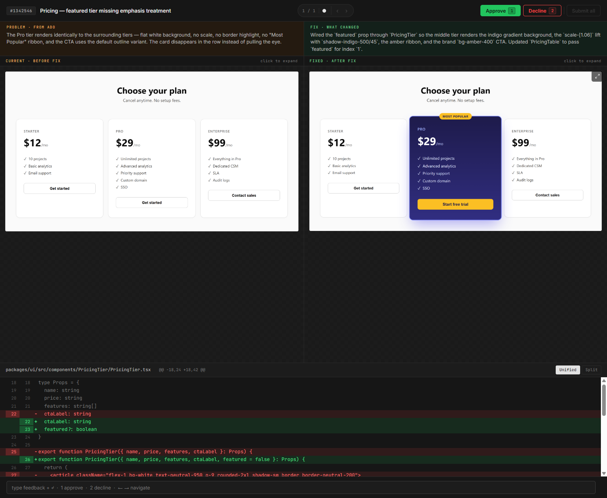

> *Originally built at PPL Electric and used in production to fix CMS-driven UI bugs in a Next.js + Storyblok app. Read the [case study](LINK_TO_CASE_STUDY_PLACEHOLDER) for the story behind it.*

# Bug Reviewer

**A human-in-the-loop bug-fix workflow for Claude Code.** An AI agent triages a bug queue, fixes the easy ones in an isolated branch, and presents every change to a human reviewer — before-and-after screenshots and a code diff, side-by-side — for approval. Only after approval does the agent open the PR.



> **Try it without setup:** `git clone` this repo, `npm install`, `npm run demo`. The reviewer UI opens in your browser with a sample bug — no Azure DevOps, Storyblok, or target codebase required.

---

## What this is

A reference implementation of the pattern: **let an agent do the boring work, but never let it commit unreviewed visual changes.** The agent batches fixes, captures a Playwright screenshot of each component before and after, and pauses at a local web UI where you approve, decline, or send the bug back with feedback. The PR is only created after every fix is approved.

It was built around one specific stack — Azure DevOps + Storyblok + a Next.js preview running locally — but the pattern (orchestrator skill → domain skills → reviewer UI → PR) is generic. The "Adapt for your stack" section below maps each integration point to a swappable skill.

---

## How it works

```
Query issue tracker → Rank difficulty → Create isolated preview
   → Screenshot (broken) → Fix code → Screenshot (fixed)
   → Run reviewer UI → Human approves → Draft PR
```

The agent is driven by a set of scoped Claude Code skills under `.claude/skills/`. The orchestrator (`bug-triage-session`) sequences the flow; each domain skill (issue tracker query, CMS story creation, screenshot capture, reviewer launch, PR creation) only loads when its turn comes up. This keeps the agent's working context small and the guardrails tight.

The reviewer UI is a single-page app that:
- Shows the original issue tracker screenshot, the broken-state and fixed-state screenshots, and a unified or split code diff
- Lets you approve, decline, or leave per-bug feedback
- Writes a `results.json` and exits when the queue is empty
- Lives at `http://localhost:3737`

---

## Quickstart (the bundled stack)

> The default flow assumes Azure DevOps + Storyblok + a Next.js dev server. If your stack is different, see "Adapt for your stack" below.

### Prerequisites

| Tool | Install |
|------|---------|
| Node.js 22+ | `brew install node` |
| Azure CLI + DevOps ext | `brew install azure-cli && az extension add --name azure-devops` |
| Playwright | `npx playwright install chromium` |
| Python 3.14+ (for Figma MCP, optional) | `brew install python@3.14` |
| jq | `brew install jq` |

You'll also need the target codebase cloned locally with its dev server running before any screenshots can be captured.

### Setup

```bash
git clone <THIS_REPO_URL>
cd bug-reviewer
npm install
cp .env.example .env   # fill in tokens — see .env.example for keys
```

For the Figma MCP server (optional — only needed if your fixes reference Figma specs):

```bash
cd figma-mcp-server
python3.14 -m venv venv && source venv/bin/activate && pip install -r requirements.txt
cd ..
```

### Run a session

In Claude Code, type:

```
/bug-triage-session
```

…or just say *"start a bug triage session."* The orchestrator handles the rest. When it reaches the reviewer step, it opens the UI and waits — review each bug, then the PR is opened automatically.

### Manual commands (if you want to run pieces directly)

```bash
npm run demo                            # launch the UI with a sample bug (no integrations needed)
node server.js bugs.json results.json   # launch reviewer UI on :3737 with your own bugs
node capture.js config.json out.json    # capture before/after for one bug
```

---

## Adapt for your stack

The repo is structured so the integration points are isolated in skills, not in the core runtime. To use this for a different stack, the moving pieces are:

| You're using… | Swap this skill |
|---|---|
| **GitHub Issues / Linear / Jira** instead of ADO | `.claude/skills/ado-bug-query/`, `.claude/skills/ado-bug-lifecycle/`, `.claude/skills/ado-pr-create/` |
| **Contentful / Sanity / Prismic** instead of Storyblok | `.claude/skills/storyblok-bugfix-story/`, `.claude/skills/storyblok-component-push/` |
| **A different preview server** (Vite, Astro, Remix, plain static) | Update the URL pattern in `bug-capture` and the running-server check in `bug-triage-session` |
| **No CMS at all** (just a component library) | Drop the Storyblok skills entirely; have `bug-capture` point at a Storybook URL instead |

The reviewer UI (`server.js` + `public/index.html`) and the capture script (`capture.js`) are CMS-agnostic — they only consume a JSON payload of `{ id, title, currentScreenshot, fixedScreenshot, codeDiff, … }`. Anything that produces that shape works.

The full payload schema lives in `.claude/skills/bug-capture/SKILL.md`.

---

## Project structure

```
bug-reviewer/
├── .claude/skills/         # The orchestrator + domain skills
│   ├── bug-triage-session/   # Top-level orchestrator
│   ├── ado-bug-query/        # Issue tracker integration
│   ├── ado-bug-lifecycle/    # Pickup / abandon / state file
│   ├── ado-pr-create/        # Draft PR + reviewers + work items
│   ├── storyblok-bugfix-story/
│   ├── storyblok-component-push/
│   ├── bug-capture/          # Playwright screenshot + git diff
│   └── bug-reviewer-run/     # Launch the reviewer UI
├── server.js               # Reviewer UI server (Express + WebSocket)
├── capture.js              # Playwright before/after + git diff parser
├── public/index.html       # Reviewer UI (single page, no build step)
├── figma-mcp-server/       # Figma API MCP (Python) — optional
├── .mcp.json               # MCP server registrations
└── CLAUDE.md               # Lean entry-point pointer to skills
```

---

## Why skills?

The original version of this tool put the entire workflow in one ~620-line `CLAUDE.md`. That worked, but as the playbook grew, three problems compounded:

1. **Context bloat.** Every prompt loaded the full playbook even when the agent was doing one narrow thing.
2. **Cross-domain leakage.** CMS auth rules were competing for attention with PR-creation rules. The agent occasionally crossed wires.
3. **Hard to evolve.** Changing one integration risked regressing another, because there was no isolation.

The current version breaks the playbook into eight scoped skills. Each skill loads only when its trigger phrase fires; each can declare its own `allowed-tools`. CLAUDE.md is now ~40 lines and just points to the skill set. The pattern is the interesting part — the specific integrations are an example.

---

## Origin

This pattern emerged from a specific need at PPL Electric: a steady stream of small visual bugs in a Next.js + Storyblok app, slow to triage manually, but each one easy enough that an LLM could handle it — IF a human approved every change before it shipped. The reviewer-as-gate idea is the heart of the tool. The skills + integrations are details that adapt to your stack.

Read the full case study: [LINK_TO_CASE_STUDY_PLACEHOLDER](LINK_TO_CASE_STUDY_PLACEHOLDER).

---

## Roadmap

Open and proposed work is tracked in [GitHub Issues](../../issues). Significant proposals (new integrations, breaking changes to the payload schema, changes to the orchestration model) are discussed in [GitHub Discussions](../../discussions) before being filed as issues. Pull requests welcome.

---

## Tech

- **Node.js 22** — reviewer server + capture script
- **Playwright** — headless screenshot capture, ignores self-signed dev certs
- **Express + ws** — reviewer UI runtime
- **Azure CLI** — ADO work item queries and PR creation (in the example flow)
- **Storyblok Management API** — story CRUD via curl (in the example flow)
- **Python 3.14** — Figma MCP server (optional)

---

## License

MIT — see [LICENSE](./LICENSE).
